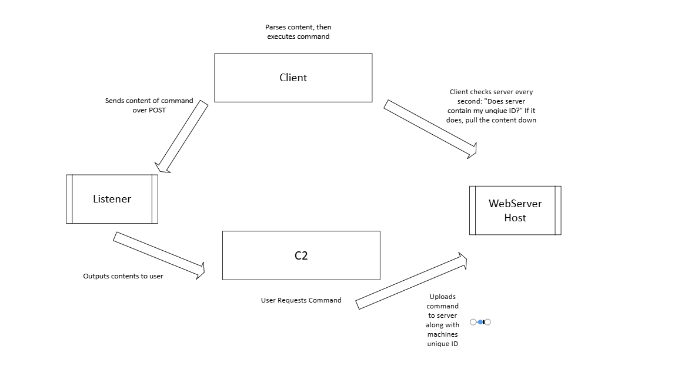

🛸 Cosmos Orbit — A Powerful Multi-OS Adversary Simulation Framework

Cosmos Orbit is a cross-platform Command & Control (C2) toolkit designed for Red Team operations. It utilizes covert web requests to establish beacon-style reverse shells, enabling stealthy post-exploitation activities across multiple operating systems.

🚀 Features
Multi-Client Support: Seamlessly manage numerous clients across different operating systems with real-time session interaction.

Prebuilt Modules:

Maintain persistence on compromised systems

Elevate sessions to administrator/root privileges

Search the system for sensitive or high-value files

Easily exfiltrate loot from target machines

...and much more

📦 Requirements
Ensure the following Python libraries are installed:

Required librays 
http.server
flask
csv
base64
pyfiglet

run Cosmo.C2.py to run the framework
